# Partie 1

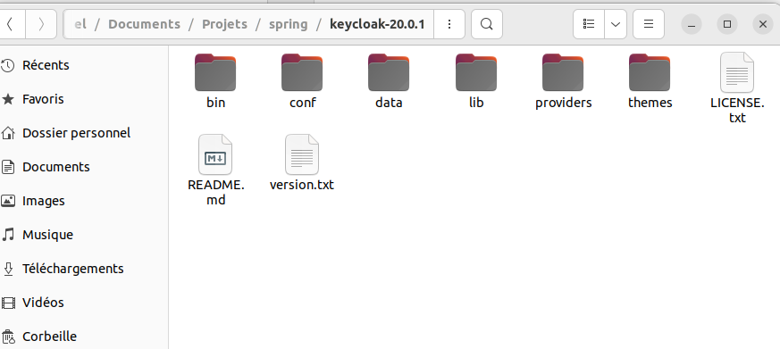
## customer service
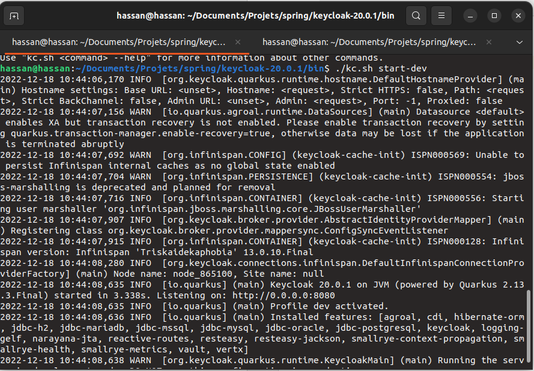
## Dashboard 
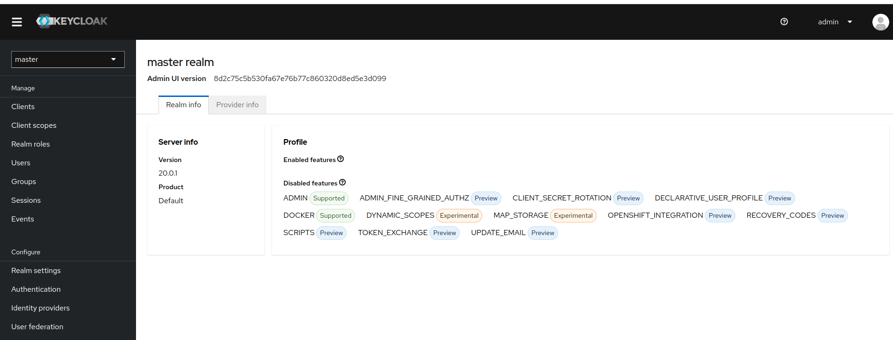
## Create realm
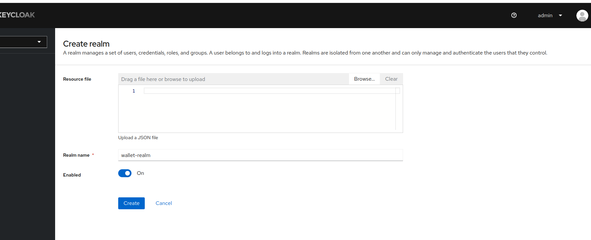
## Create client
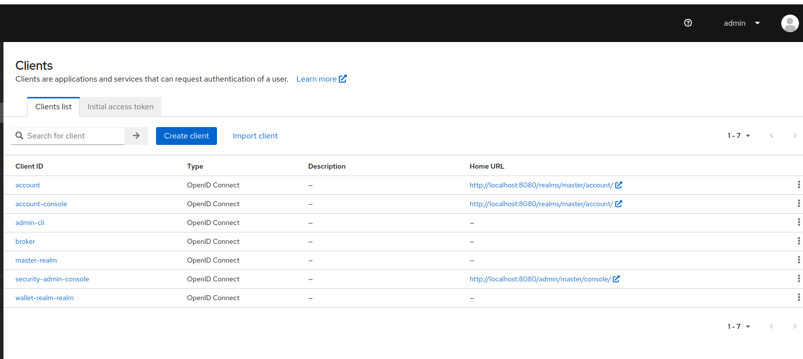
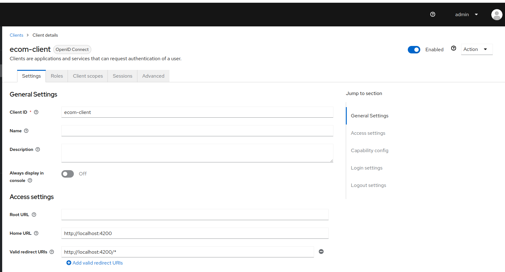
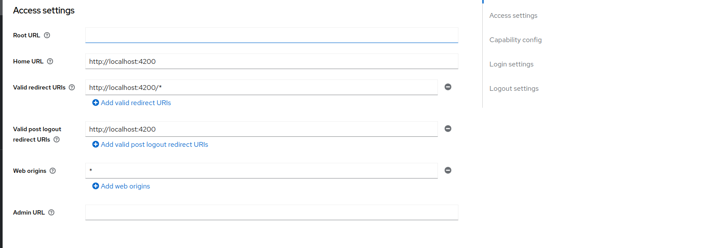
## Create user
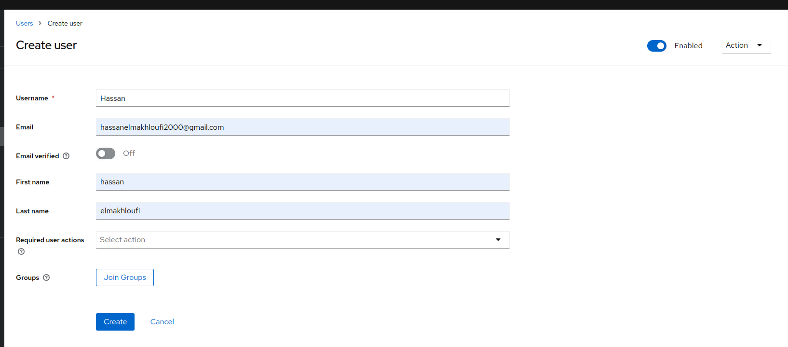
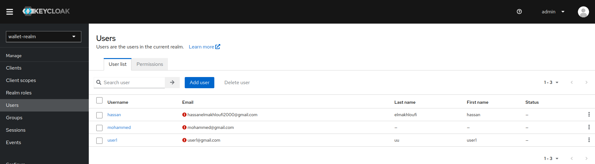
## Create roles
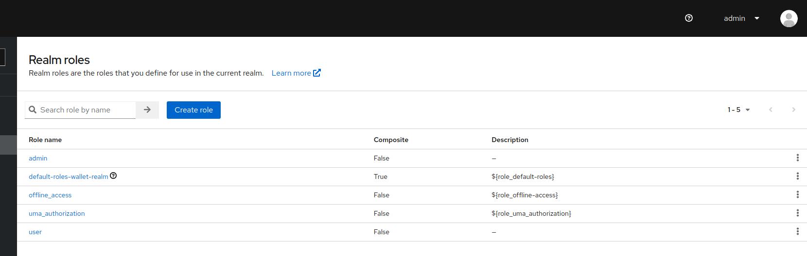
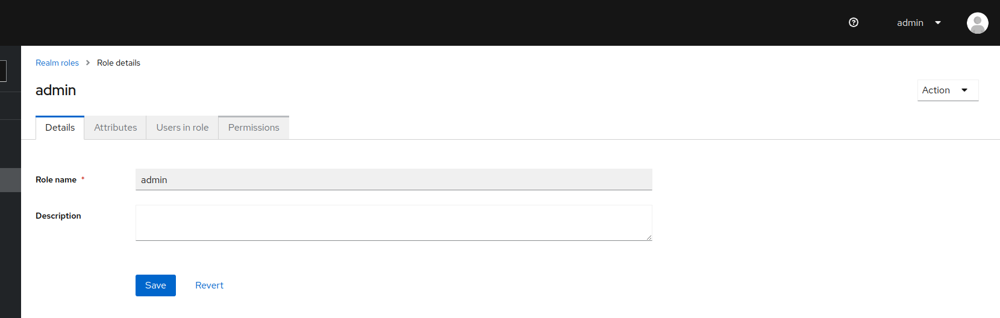
## Test authentication
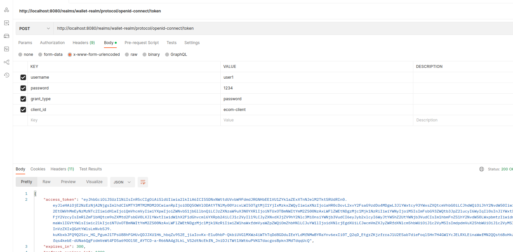

## JWT
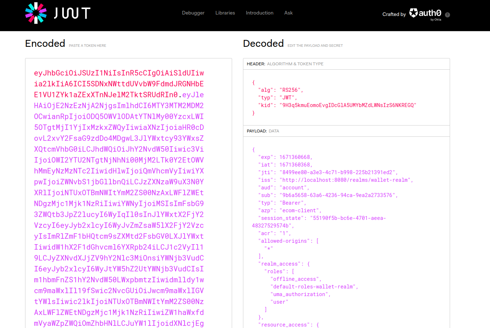
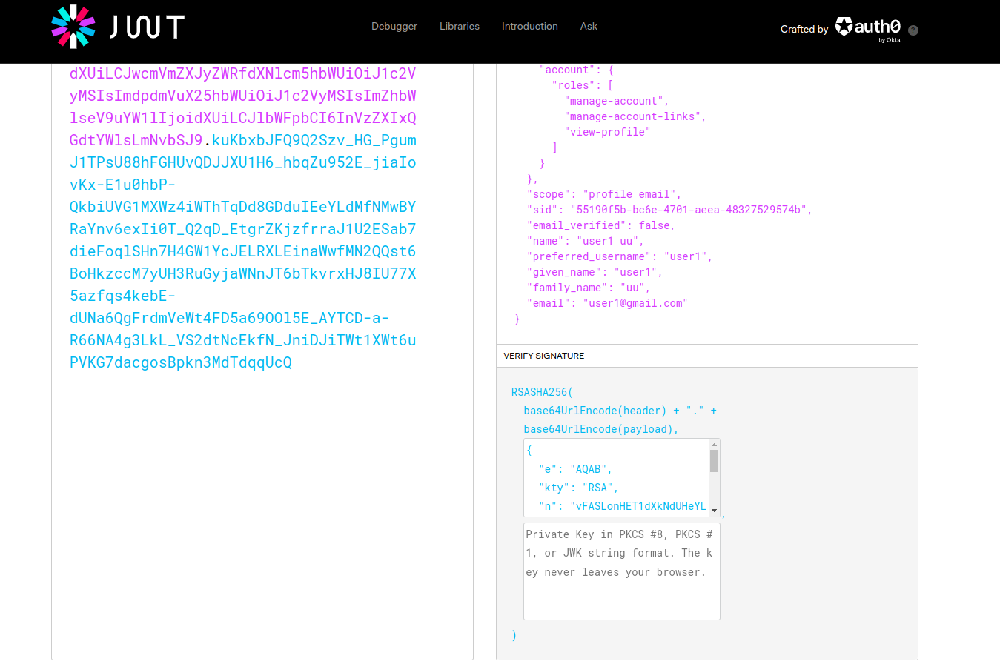
## Test authentication with refresh token
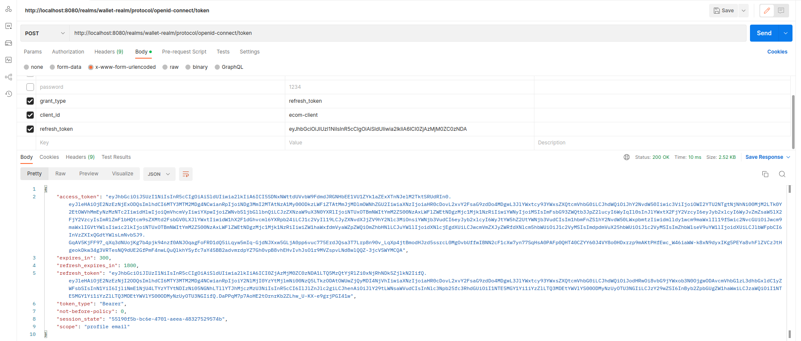

# Partie 2
Sécuriser L'architecture Micro services du projet Customer-service, Inventory-service et Order-service

Add depend
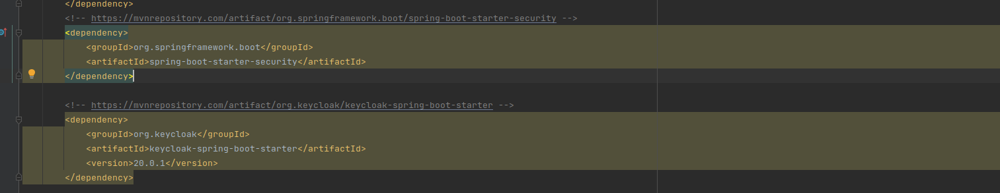
# update conf file
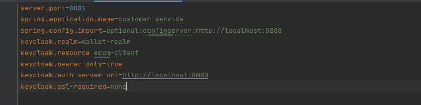
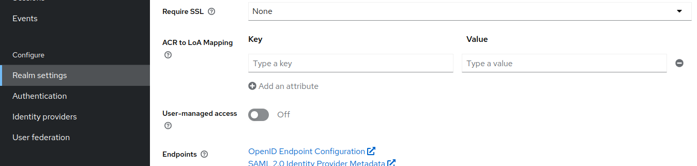
#  Create configuration
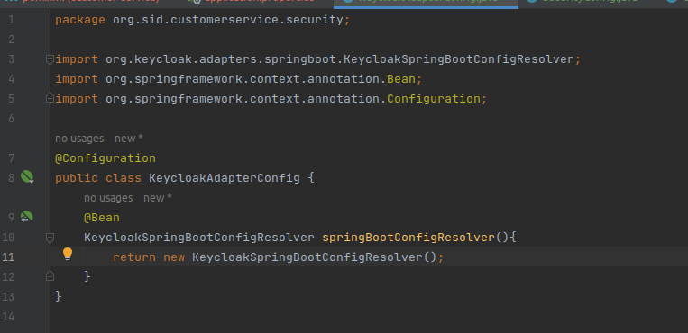
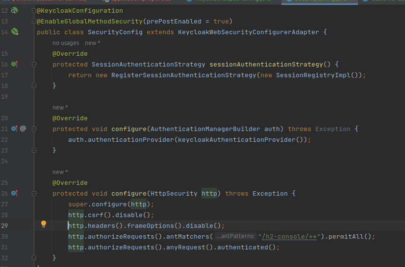
# Test without authentication
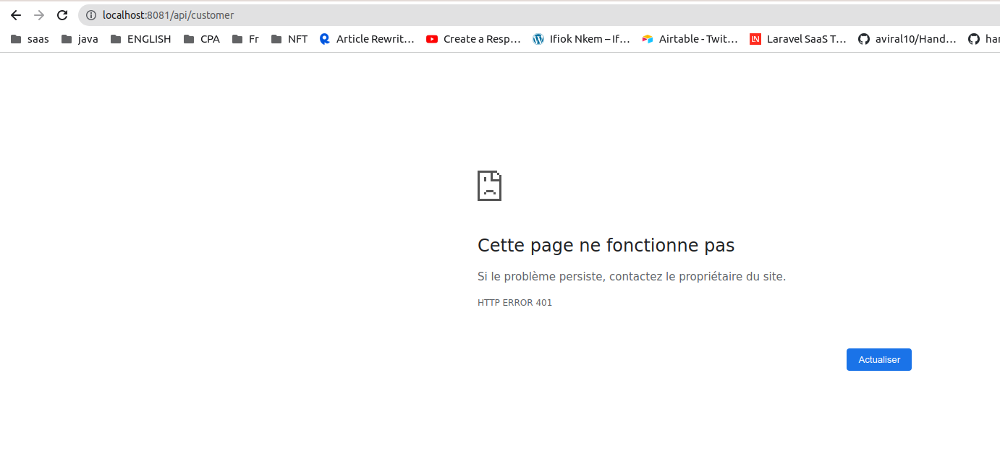
# send request with Token
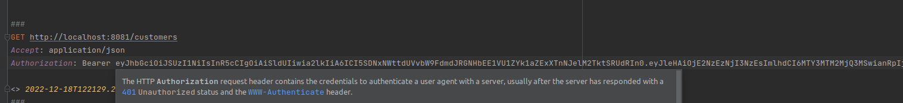
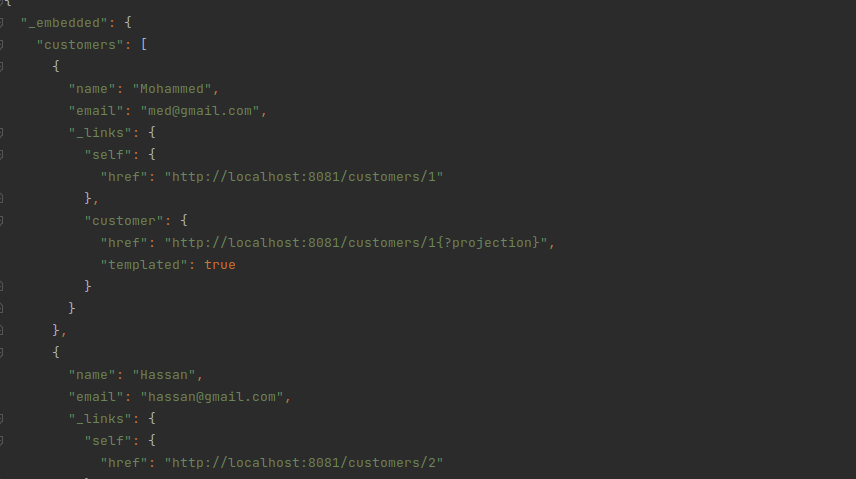